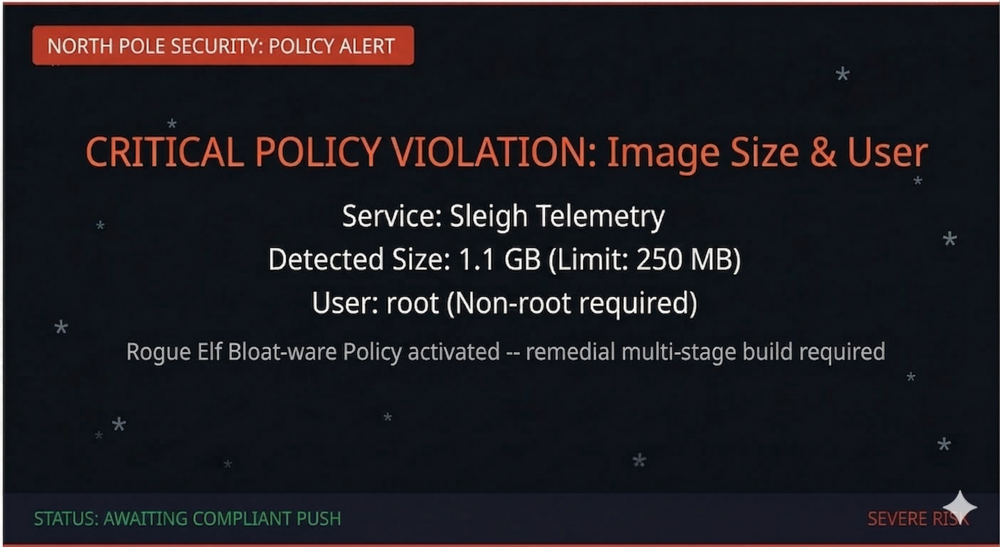

> **Points:** 200
>
> **Prerequisites:** Basic Docker/Dockerfile knowledge, understanding of container images and layers
>
> **Learning Objectives:** Multi-stage builds, layer caching, non-root users (SCC compliance), `.dockerignore` usage, `ARG` parameterization, image pinning, OCI labels, and `HEALTHCHECK`.

# The Bloated Sleigh Image

## The Situation

The rogue elves are at it again. This time they have targeted the North Pole's container build pipeline. Their latest sabotage? A monstrously oversized Docker image for the **Sleigh Telemetry Service** - a simple FastAPI application that should be small and lean, but the rogue elves have inflated it to over **1 GB** by using terrible Dockerfile practices.

Even worse, the container runs as **root**. If the rogue elves manage to exploit the application, they would have full control over the container's filesystem, processes, and potentially the host node itself.

The Chief Holiday Officer has had enough. A new North Pole Container Standard has been issued:

> *"No container image shall exceed 250 MB in size. No container shall run as the root user. All images must utilize layer caching, define build-time parameterization, include standard metadata labels, and declare a healthcheck. Violations will result in immediate rejection from the Sleigh Deployment Pipeline."*

## Your Mission

The rogue elves' Dockerfile is located in `~/bloated-app/`. Rewrite it to produce a **production-ready, secure, minimal container image** that perfectly follows the "Golden Rules of Dockerfiles".

- The final image must be pushed to the local registry at `localhost:30500/sleigh-telemetry:latest`.
- The image must strictly meet all North Pole Container Standards (including OpenShift `restricted-v2` SCC compliance).
- The application must still start and respond correctly.

Investigate the existing Dockerfile, understand what's wrong with it, and rebuild it properly.

Good luck, Security Elf. The Sleigh Deployment Pipeline depends on it.
