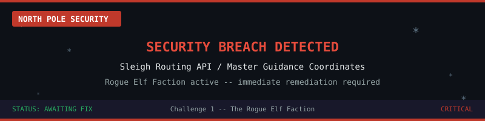

> **Points:** 100
>
> **Prerequisites:** Basic Kubernetes knowledge (Pods, Deployments, Secrets), basic Helm usage
>
> **Learning Objectives:** Kubernetes Secrets management, volume mounts, minimizing secret blast radius, kube-linter validation

# The Exposed Coordinates

## The Situation

The rogue elves are getting desperate. After failing to disrupt the cluster's basic infrastructure and storage engines, they have turned their attention toward scraping our raw data.

During a recent security audit, the Chief Holiday Officer discovered a critical vulnerability: the Sleigh Routing API deployed in our Kubernetes cluster is reading the Master Guidance Coordinates from a **plaintext environment variable**. The rogue elves are actively scraping process trees and container logs to steal this token.

## The Mitigation

To stop the leak, the Elven Engineering Team has updated the source code and rebuilt the container image. The application has been modified to read its credentials from a **secure, file-based source** instead of an environment variable.

Your role as Senior Security Elf is to update the cluster's deployment configuration so the coordinates are mounted securely and the application can locate them.

## What You Have

- **The Helm Chart:** Located at `~/masterclass-fastapi-app/`
- **A Kubernetes Secret** already exists in the cluster containing the coordinates.
- **The updated application image** is already deployed - it just needs a proper configuration.

Investigate the cluster, the Helm chart, and the application to understand how everything fits together. Then make the necessary changes.

Good luck, Security Elf. The Chief Holiday Officer is watching.
