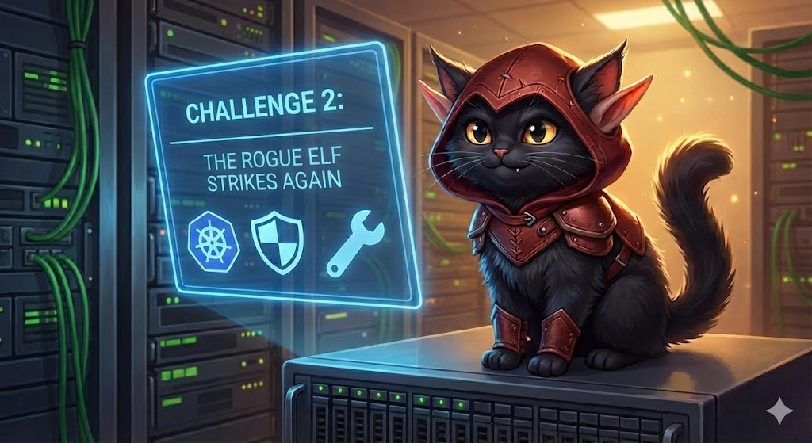

# Challenge 4: The Bloated Sleigh Image

## The Situation

The rogue elves are at it again. This time they have targeted the North Pole's container build pipeline. Their latest sabotage? A monstrously oversized Docker image for the **Sleigh Telemetry Service** — a simple FastAPI application that should weigh in at around 60–80 MB, but the rogue elves have inflated it to over **1 GB** by using terrible Dockerfile practices.

Even worse, the container runs as **root**. If the rogue elves manage to exploit the application, they would have full control over the container's filesystem, processes, and potentially the host node itself.

The Chief Holiday Officer has had enough. A new North Pole Container Standard has been issued:

> *"No container image shall exceed 250 MB in size. No container shall run as the root user. Violations will result in immediate rejection from the Sleigh Deployment Pipeline."*

## The Problem

The rogue elves' Dockerfile (located in `~/bloated-app/`) commits every cardinal sin of container image building:

1. **Full OS base image** — Uses `python:3.13` (the full Debian-based image, ~1 GB) instead of a slim or distroless variant.
2. **No multi-stage build** — Build dependencies (compilers, headers, pip cache) are all baked into the final image.
3. **Runs as root** — No `USER` directive, so the container process runs as PID 1 with root privileges.
4. **Copies unnecessary files** — No `.dockerignore`, so everything gets dumped into the image context.
5. **No layer optimization** — Dependencies and source code are copied in a single layer, busting the cache on every build.

## Your Mission

Rewrite the Dockerfile in `~/bloated-app/` to produce a **production-ready, secure, minimal container image**. You must:

1. **Use a multi-stage build** — Separate the build stage (where you install dependencies) from the final runtime stage.
2. **Choose a minimal base image** — Use `python:3.13-slim` (or smaller) for the final stage. Distroless or Alpine variants are also acceptable.
3. **Run as a non-root user** — Create a dedicated application user and set the `USER` directive so the container never runs as root.
4. **Keep the image under 250 MB** — The final image pushed to the local registry must be smaller than 250 MB.
5. **Ensure the application still works** — The FastAPI app must start and respond on port `8000`.

## Technical Resources

- **The Application:** Located at `~/bloated-app/`. It is a simple FastAPI app with a `requirements.txt`.
- **The Local Registry:** A private container registry is available at `localhost:30500`.
- **Build and Push:** Build your image and push it to the local registry:

```bash
# Build the image
docker build -t localhost:30500/sleigh-telemetry:latest ~/bloated-app/

# Push to the local registry
docker push localhost:30500/sleigh-telemetry:latest
```

Use these commands to inspect your image:

```bash
# Check the image size
docker images localhost:30500/sleigh-telemetry:latest

# Inspect the user the container runs as
docker inspect localhost:30500/sleigh-telemetry:latest --format '{{.Config.User}}'

# Test the application starts correctly
docker run --rm -d --name test-app -p 8000:8000 localhost:30500/sleigh-telemetry:latest
curl http://localhost:8000/
docker stop test-app
```

## Requirements for Validation

To pass the Elf Validation Script, your image must meet **all** of the following:

1. **Image exists in the local registry** — `localhost:30500/sleigh-telemetry:latest` must be pushed.
2. **Image size is under 250 MB** — Measured by `docker images`.
3. **Container does NOT run as root** — The `USER` directive must be set to a non-root user (UID != 0).
4. **Application responds** — The app must return a valid HTTP response on port `8000`.
5. **Multi-stage build is used** — The Dockerfile must contain more than one `FROM` instruction.

Rebuild, slim down, and secure that image, Security Elf. The Sleigh Deployment Pipeline depends on it.
