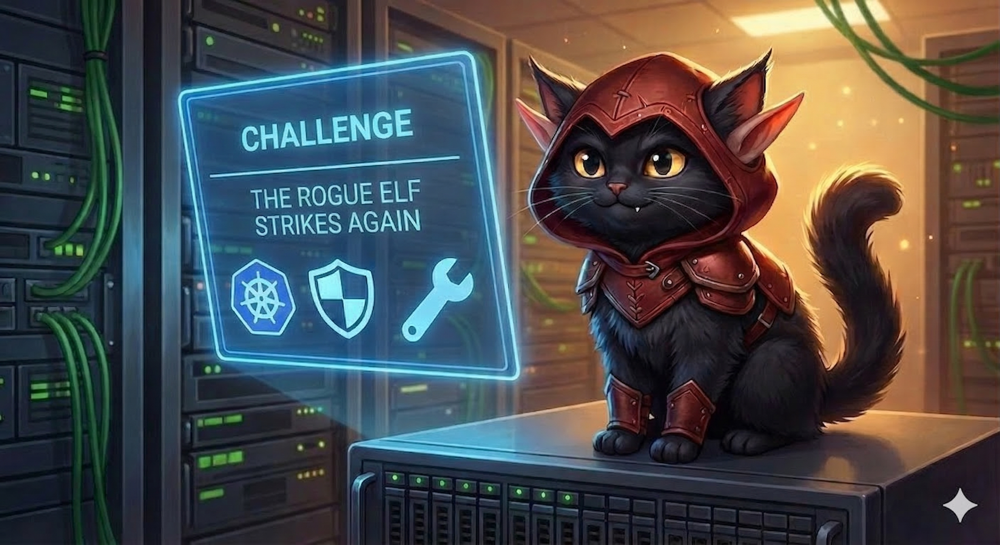

> **Points:** 300
>
> **Prerequisites:** Kubernetes deployment manifests, Kubernetes security contexts, basic understanding of admission controllers
>
> **Learning Objectives:** Policy enforcement, Manifest debugging, container security context (non-root, drop capabilities), resource requests/limits, health probes, standard labeling, ServiceAccount isolation

# The Trojan Manifest

## The Situation

The rogue elves haven't given up. Having failed to bloat the Sleigh Telemetry container image, they are now trying a different approach: bypassing the deployment pipeline entirely by submitting insecure, manual YAML manifests into the North Pole Kubernetes cluster.

They've managed to submit a basic Kubernetes deployment manifest (located at `~/app.yaml`) to deploy a new "gift-tracking" API. Unsurprisingly, it's riddled with common security and operational misconfigurations.

## The Countermeasure

Anticipating this, the Chief Holiday Officer has deployed a **Kubernetes policy engine** across the cluster. It is armed with admission policies that will outright reject any resources that do not meet the North Pole's production standards.

Your role as Senior Security Elf is to analyze the rogue elves' manifest, identify the misconfigurations blocking its deployment, and refactor it to meet the cluster's security standards.

## Your Mission

1. **Deploy the Manifest:** Attempt to apply the manifest to the cluster to see what happens.
2. **Find the Errors:** When the policy engine blocks the deployment, use the feedback to identify which policies the manifest violates.
3. **Fix the Manifest:** Modify the configuration within `~/app.yaml` so it adheres to all security requirements.
4. **Verify:** You are done when you can successfully deploy the manifest without being rejected.

The cluster has all the information you need. Investigate, debug, and fix.

Good luck, Security Elf. Let's lock this cluster down.
